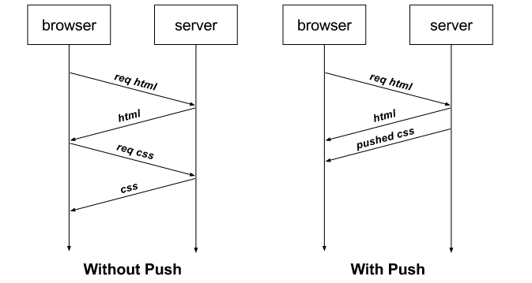

# demo-go-http-server-push


This project show how using http server push


HTTP/2 is designed to address many of the failings of HTTP/1.x. Modern web pages use many resources: HTML, stylesheets, scripts, images, and so on. In HTTP/1.x, each of these resources must be requested explicitly. This can be a slow process. The browser starts by fetching the HTML, then learns of more resources incrementally as it parses and evaluates the page. Since the server must wait for the browser to make each request, the network is often idle and underutilized.

To improve latency, HTTP/2 introduced server push, which allows the server to push resources to the browser before they are explicitly requested. A server often knows many of the additional resources a page will need and can start pushing those resources as it responds to the initial request. This allows the server to fully utilize an otherwise idle network and improve page load times.



```go
http.HandleFunc("/", func(w http.ResponseWriter, r *http.Request) {
    if r.URL.Path != "/" {
	    http.NotFound(w, r)
	    return
    }
    pusher, ok := w.(http.Pusher)
	if ok {
	    // Push is supported. Try pushing rather than
	    // waiting for the browser request these static assets.
	    if err := pusher.Push("/static/style.css", nil); err != nil {
	        log.Printf("Failed to push: %v", err)
		}
	}
	..
})
```

For more details: https://blog.golang.org/h2push